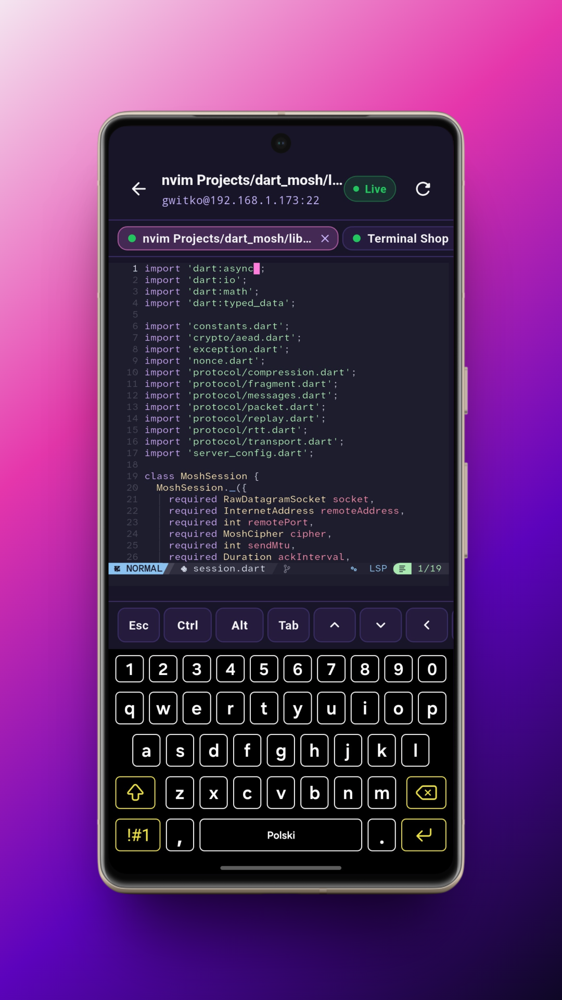
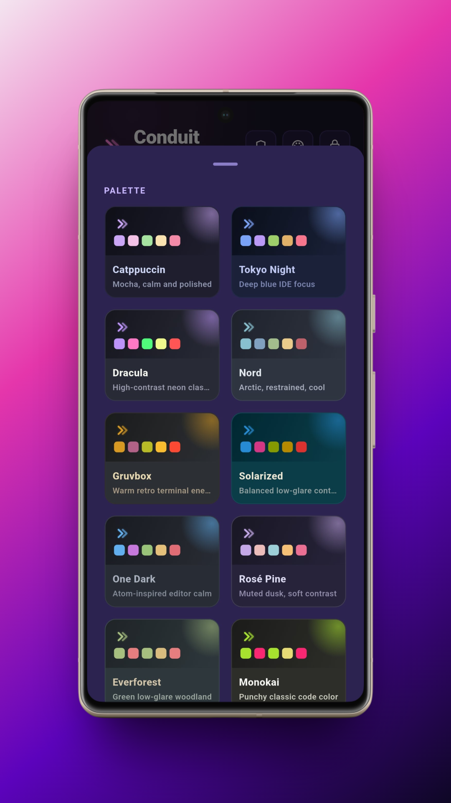
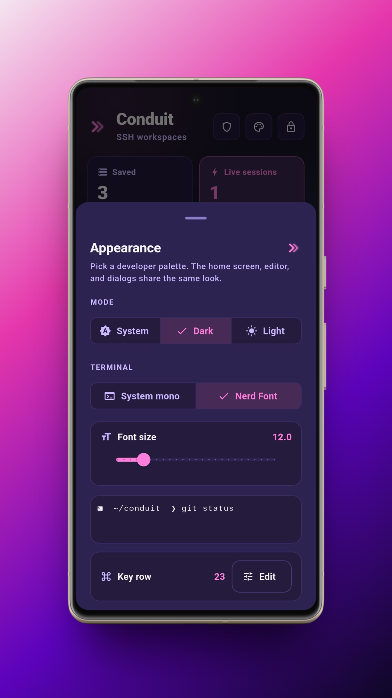
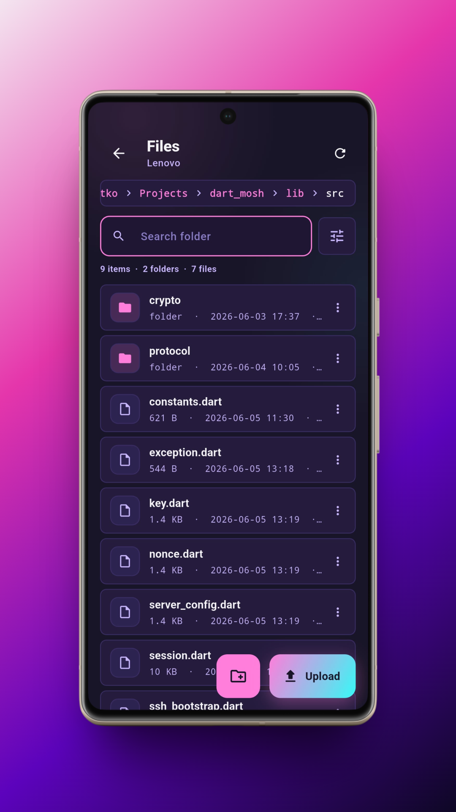
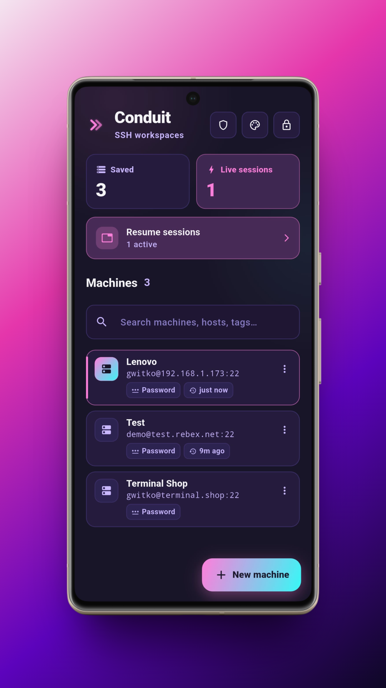
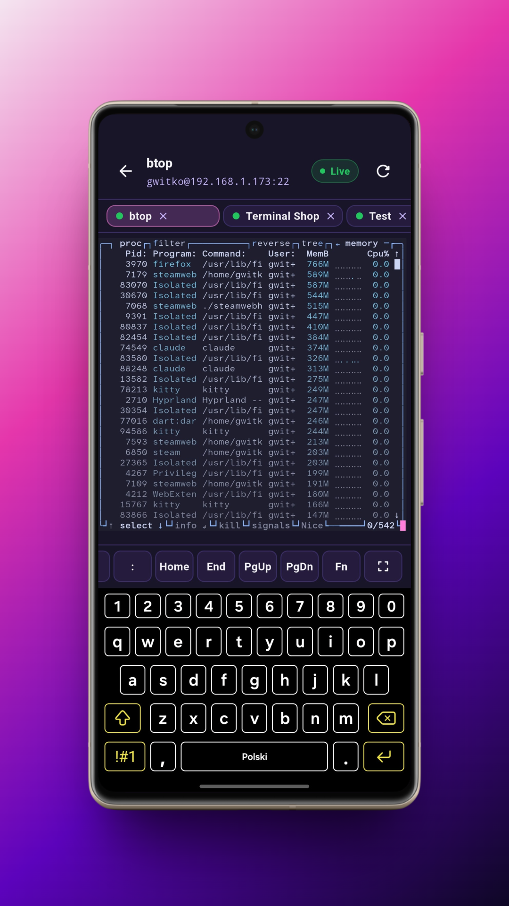
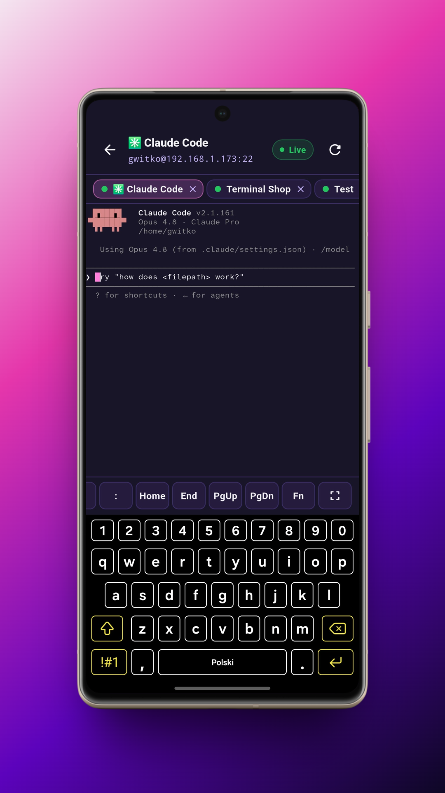
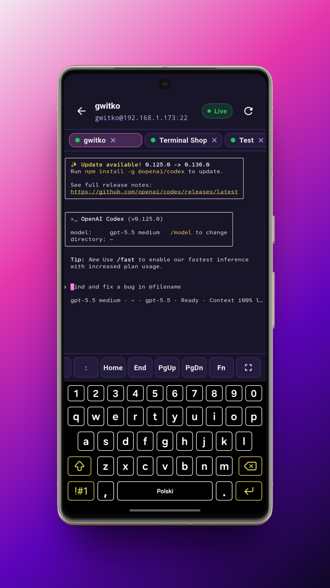
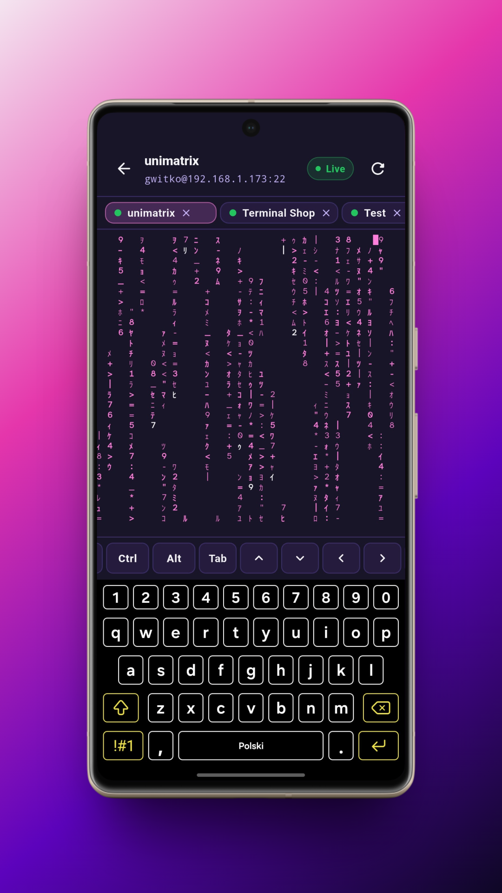

# Conduit：终端、SSH、Mosh 与 SFTP

> [!CAUTION]
> Android 正逐渐走向封闭。[请伸出援手，共同维护它的开放性](https://keepandroidopen.org)。

Conduit 的源代码采用 [Apache-2.0](LICENSE) 协议开源。不过，包含本地 shell 的 Android 版本也会分发一些第三方二进制文件，这些文件受它们各自的开源协议约束；详情请参阅 [致谢](#致谢) 和 [第三方声明](THIRD_PARTY_NOTICES.md)。

Conduit 旨在让你直接从手机连接远程主机，无需登录任何账号。主机信息、私钥及信任的主机指纹均保存在本地设备上——无需注册账号、无需云端同步，亦无订阅费用。你可以开启普通的 SSH shell，也可以使用 Mosh 会话，后者在 Wi-Fi 信号中断或网络在 Wi-Fi 和移动数据间切换时仍能保持连接，避免会话异常中断。会话以标签页形式管理，屏幕下方配有专为弥补手机虚拟键盘不足而设计的修饰键、方向键和功能键。此外，你可以为每台主机单独配置 tmux集成，在连接时自动创建或接入已有会话，并指定起始工作目录；按键栏内也内置了 tmux 前缀键、常用操作快捷键以及翻页控制。

在 Android arm64 设备上，Conduit 还支持通过 proot 运行可选的本地 Arch Linux shell。首次使用时会自动下载 Arch Linux ARM 镜像，并能像其他终端标签页一样直接打开。

此外，项目还提供用于文件传输的 SFTP 浏览器、自主管理的主机密钥信任机制、可选的设备认证应用锁，以及多款内置终端主题（Catppuccin、Tokyo Night、Gruvbox、Nord 等），后续还将加入对电子墨水屏设备的支持！

Mosh 功能基于 [dart_mosh](https://github.com/gwitko/dart_mosh) 运行（这是用 Dart 从头实现的 Mosh 协议栈），终端模拟器采用 fork 自 xterm.dart 的 [conduit_vt](https://github.com/gwitko/conduit_vt)。

## 功能列表

- SSH 终端会话：支持保存主机配置，提供标签过滤与搜索，可按最近连接、名称或添加时间排序，支持多标签页并行工作。
- Mosh 会话：在 Wi-Fi 中断或网络切换后自动恢复连接。
- 每台主机独立配置 tmux 集成：连接时自动接入或新建会话，支持指定工作目录，并在按键栏中提供自定义前缀键、常用快捷键和翻页控制。
- SFTP 文件浏览器：支持浏览、下载、上传、重命名和删除文件。
- 支持 OpenSSH 私钥、密码、硬件安全密钥以及服务端驱动的键盘交互式认证。
- 从文件导入私钥，或直接在设备上生成 `ed25519` 密钥，支持使用 passphrase 加密保护，并可一键复制或导出公钥。
- 支持 OpenSSH FIDO 安全密钥认证（`ed25519-sk` / `ecdsa-sk`），已在 YubiKey 上验证，兼容所有符合 CTAP 规范的硬件密钥。
- Android 支持通过 USB 和 NFC 进行硬件密钥认证；iOS 支持通过 NFC 认证。
- SSH Agent 转发：可按主机单独开启。支持转发私钥和硬件密钥，以便在远端主机上继续进行后续节点的跳转连接；出于安全考虑，已转发的硬件密钥在每次签名时仍需物理触摸确认。
- 主机密钥信任管理：首次连接时手动核查并信任指纹。
- 可自定义的屏幕辅助按键栏：支持修饰键、方向键、功能键、长按连发、粘滞键，以及自定义文本和 Ctrl 组合键。
- 可选应用锁：可启用设备生物识别（指纹/面容）或锁屏密码，保护已保存的主机信息和凭据。
- 丰富的界面自定义：内置多款终端主题，支持调节字体大小、配色方案及外观设置。
- 本地 Arch Linux shell（仅支持 Android arm64）：内置 pacman，通过 proot 在非特权模式下运行——无需 Root 权限，也无需配置服务器。使用 Termux 打包的工具链。
- 本地优先设计：数据完全离线存储在设备本地，无需注册账号、无需云端同步，亦无订阅费用，永久免费。

## 致谢

本地 shell 使用了由 [Termux](https://termux.dev) 项目打包和维护的 Android 版开源工具：

- **[proot](https://github.com/termux/proot)**：在非特权 Linux 环境下提供 chroot/ptrace 的用户空间引擎。
- **Arch Linux ARM** rootfs：通过 Termux 的 **[proot-distro](https://github.com/termux/proot-distro)** 进行分发，该项目由 [Arch Linux ARM](https://archlinuxarm.org) 团队维护。
- `busybox`、GNU `tar`、`xz`/`liblzma`、`libtalloc` 以及 `libandroid-*` shims。

如果本地 shell 对你有所帮助，请考虑支持 [Termux](https://github.com/sponsors/termux)、[GNU/FSF](https://www.fsf.org/about/ways-to-donate) 或 [Arch Linux ARM](https://archlinuxarm.org/about/donate)。

Conduit 根据这些组件各自的许可协议进行分发，并为 GPL/LGPL 组件提供相应的源码提供声明。详细的组件列表、许可证文本、上游源码归档、确切的包校验和以及构建配方快照均可在 **[第三方声明](THIRD_PARTY_NOTICES.md)** 中查看。GPL/LGPL 源码提供声明的细节请参阅 **[开源合规与源码归档](third_party/source-offer)**。

Conduit 的源代码采用 [Apache-2.0](LICENSE) 协议开源，但不会改变内置的第三方二进制文件及下载的 rootfs 软件包的原有许可协议。此外，Mosh 功能基于 [dart_mosh](https://github.com/gwitko/dart_mosh) 运行，终端模拟器采用 fork 自 xterm.dart 的 [conduit_vt](https://github.com/gwitko/conduit_vt)。

## 贡献者

Conduit 得益于社区的共同参与而不断完善。完整的贡献者致谢名单请参阅 [贡献者名单](CONTRIBUTORS.md)。

## 截图

  
  
  
  

  
  
  
  

  
  
  
  

